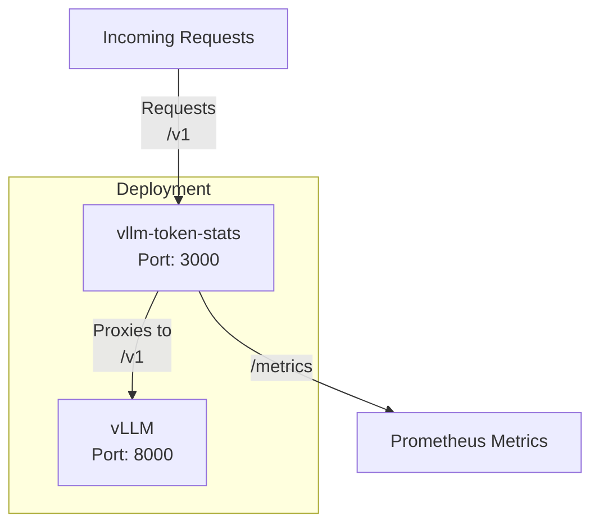

# vllm-token-stats

Proxy for vLLM to expose token usage metrics.

# architecture

vllm-token-stats is a solution to proxify incoming requests to vLLM and collect statistics of used tokens by different clients. 
It requires next RBAC permissions to get clients name and namespace:

```
- apiGroups: [""]
  resources: ["pods"]
  verbs: ["get", "list"]
```



It provides metrics in Prometheus format, example:

```
# HELP vllm_prompt_tokens Prompt tokens used by VLLM
# TYPE vllm_prompt_tokens counter
vllm_prompt_tokens{namespace="default",client_name="sh",full_path="/v1/completions",hostname="vllm-66855dfbf7-m5njg"} 6
vllm_prompt_tokens{namespace="test",client_name="benchmark",full_path="/v1/completions",hostname="vllm-66855dfbf7-m5njg"} 406149

# HELP vllm_completion_tokens Completion tokens produced by VLLM
# TYPE vllm_completion_tokens counter
vllm_completion_tokens{namespace="default",client_name="sh",full_path="/v1/completions",hostname="vllm-66855dfbf7-m5njg"} 100
vllm_completion_tokens{namespace="test",client_name="benchmark",full_path="/v1/completions",hostname="vllm-66855dfbf7-m5njg"} 359592

# HELP vllm_total_tokens Total tokens processed by VLLM
# TYPE vllm_total_tokens counter
vllm_total_tokens{namespace="default",client_name="sh",full_path="/v1/completions",hostname="vllm-66855dfbf7-m5njg"} 106
vllm_total_tokens{namespace="test",client_name="benchmark",full_path="/v1/completions",hostname="vllm-66855dfbf7-m5njg"} 765741
```

# installation

You can install example yaml manifest with all required components (deployment with vLLM and proxy, service, rbac, PodMonitor) in GKE Autopilot cluster:

```
kubectl apply -f https://raw.githubusercontent.com/ganochenkodg/vllm-token-stats/refs/heads/main/vllm-l4.yaml
```

Example output:

```
serviceaccount/log-proxy-sa created
clusterrole.rbac.authorization.k8s.io/log-proxy-cluster-role created
clusterrolebinding.rbac.authorization.k8s.io/log-proxy-cluster-role-binding created
deployment.apps/vllm created
service/vllm-endpoint created
podmonitoring.monitoring.googleapis.com/vllm-token-stats created
```

# performance

The difference in performance between a direct connection to vLLM and through vllm-token-stats is insignificant.

Benchmark results for g2-standard-4 node, one Nvidia L4 GPU and Lllama-3.1-8b-Instruct model:

```
python3 benchmark_serving.py \
  --backend openai \
//--base-url http://vllm-endpoint.default.svc:8000 \
  --base-url http://vllm-endpoint.default.svc:3000 \
  --model unsloth/Meta-Llama-3.1-8B-Instruct \
  --dataset-name sharegpt \
  --dataset-path ShareGPT_V3_unfiltered_cleaned_split.json
```

Direct connection:

```
============ Serving Benchmark Result ============
Successful requests:                     1000
Benchmark duration (s):                  343.76
Total input tokens:                      215196
Total generated tokens:                  197107
Request throughput (req/s):              2.91
Output token throughput (tok/s):         573.38
Total Token throughput (tok/s):          1199.39
---------------Time to First Token----------------
Mean TTFT (ms):                          140519.21
Median TTFT (ms):                        138940.03
P99 TTFT (ms):                           294126.89
-----Time per Output Token (excl. 1st token)------
Mean TPOT (ms):                          159.13
Median TPOT (ms):                        139.51
P99 TPOT (ms):                           603.73
---------------Inter-token Latency----------------
Mean ITL (ms):                           138.68
Median ITL (ms):                         95.72
P99 ITL (ms):                            617.65
==================================================
```

Through the proxy:

```
============ Serving Benchmark Result ============
Successful requests:                     1000
Benchmark duration (s):                  357.18
Total input tokens:                      215196
Total generated tokens:                  198054
Request throughput (req/s):              2.80
Output token throughput (tok/s):         554.49
Total Token throughput (tok/s):          1156.96
---------------Time to First Token----------------
Mean TTFT (ms):                          138294.06
Median TTFT (ms):                        126404.99
P99 TTFT (ms):                           300286.19
-----Time per Output Token (excl. 1st token)------
Mean TPOT (ms):                          152.34
Median TPOT (ms):                        138.11
P99 TPOT (ms):                           455.29
---------------Inter-token Latency----------------
Mean ITL (ms):                           135.52
Median ITL (ms):                         95.46
P99 ITL (ms):                            608.47
==================================================
```

~96.5% performance of direct benchmarking

Typical resource consumption under load:

```bash
$ kubectl top pod --containers=true vllm-66855dfbf7-m5njg
POD                     NAME               CPU(cores)   MEMORY(bytes)
vllm-66855dfbf7-m5njg   inference-server   850m         7732Mi
vllm-66855dfbf7-m5njg   vllm-token-stats   83m          284Mi
```
